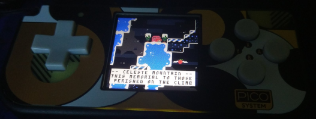

# yocto-8

## An incomplete PICO-8 cartridge runner for the Raspberry Pi Pico 2.

[PICO-8](https://www.lexaloffle.com/pico-8.php) is a fantasy game console from Lexaloffle which allows you to create, edit, share and play small games in a virtual console.  
yocto-8 is a PICO-8 implementation that aims to run unmodified games.

That's the plan anyway -- see [the current progress](#plans).

> [!IMPORTANT]
> See the tag [`rp2040-obsoleted`](https://github.com/yocto-8/yocto-8/tree/rp2040-obsoleted) for the branch used for the RP2040/PicoSystem ports of yocto-8.
>
> The project should start moving away to RP2350-based design for performance and PSRAM interfacing reasons.

The main implementation goals are:
- To reach good PICO-8 compatibility
- To be as fast as possible, and to minimize the RAM footprint as much as reasonably possible
- To be generally portable to platforms with a high quality C++20 toolchain

The current plan is not to be a PICO-8 devkit, that is, it will not provide any editor tools.

yocto = pico².

<h1 id="plans">Progress and plans</h1>

With some modifications, **some** demos and games run. **Don't expect it to run much of anything,** manual intervention is often needed to get a cartridge to work (but hopefully fewer as time goes on).

Audio support is completely non-existent currently.

It is possible to build and run yocto-8 on the desktop which is currently the preferred way for implementing new API features due to facilitated debugging and allowing a faster development cycle in general. The main target remains the embedded implementation.

This is currently in an early stage: there is no user-friendly way to get this working yet and most cartridges will not work.

On the hardware side, the idea is to prototype a RP2350-based handheld.

Obsolete PSRAM segment, relevant for RP2040 (discontinued)

A significant problem is the reliance on [a hack](doc/extmem.md) that enables mapping of SPI RAM.  
At the moment, this hack is very slow and may compromise the usage of the RP2040 for a real handheld project. Many games and demos rely on using way more memory than the RP2040 SRAM could provide no matter how many optimizations are done.  
There is a lot of room for optimization for the RAM hack routine. It is currently not known what real world performance can be theoretically reached.

There are (uncertain) plans to design a real handheld. The main two contenders are the RP2040 and the ESP32-S3 (which supports QSPI RAM), but there are drawbacks to both of these.

# Limitations

- This does currently only aim to be a pico-8-compatible **game runner**, not an editor.
- There is currently no plan to support games that require the "devkit"'s mouse or extra keyboard keys.
- No emulation of "CPU cycles" as calculated by pico-8 is planned for now: Game performance will be limited by how fast the hardware can run it.

# Supported platforms

- `Y8_ARCH=desktop`: Desktop (both with a SFML frontend and headless), primarily for testing

RP2350 isn't supported yet, but is planned. The `asupico` configuration should be ported to RP2350 (most likely the [Pimoroni Pico Plus 2](https://shop.pimoroni.com/products/pimoroni-pico-plus-2?variant=42092668289107) because it has PSRAM). Currently I have not documented the wiring, and probably won't for a while as I change hardware.

## Abandoned & incomplete, tag [`rp2040-obsoleted`](https://github.com/yocto-8/yocto-8/tree/rp2040-obsoleted)

  
yocto-8 running [Celeste Classic](https://mattmakesgames.itch.io/celesteclassic) on the [PicoSystem](https://shop.pimoroni.com/products/picosystem).

- `Y8_ARCH=pico`: Raspberry Pi Pico based platforms
    - `Y8_PLATFORM=asupico`: My setup (Pico+SSD1351 display+8MB PSRAM+push buttons)
    - `Y8_PLATFORM=picosystem`: [Pimoroni PicoSystem](https://shop.pimoroni.com/products/picosystem)

# Pros and cons against a SBC-based solution

Pros:
- ~Instant bootup
- Some extra appeal: hackable firmware and allowing to support a niche specific-purpose device
- Usually lower cost
- It should be possible to drive power draw quite a bit lower

Cons:
- SBCs-based solutions are more general purpose (e.g. cheap emulation handhelds)
- SBCs are more versatile (WiFi & Bluetooth, etc)
- Will probably never be *fully* compatible with all PICO-8 games
- No editor tools, etc.
- More standard hardware